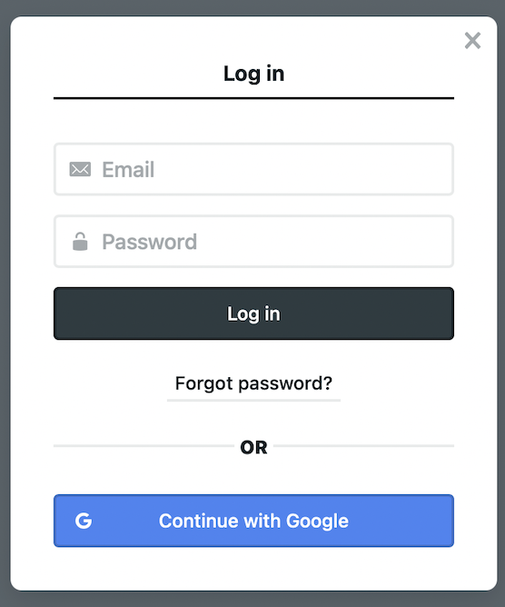
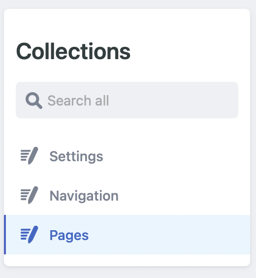
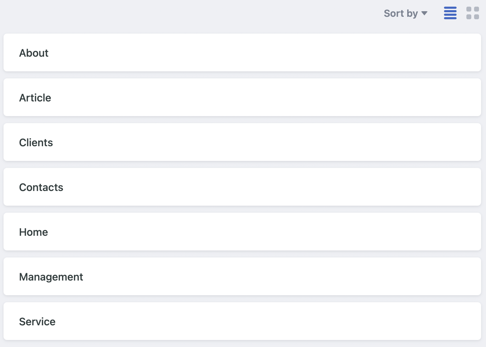
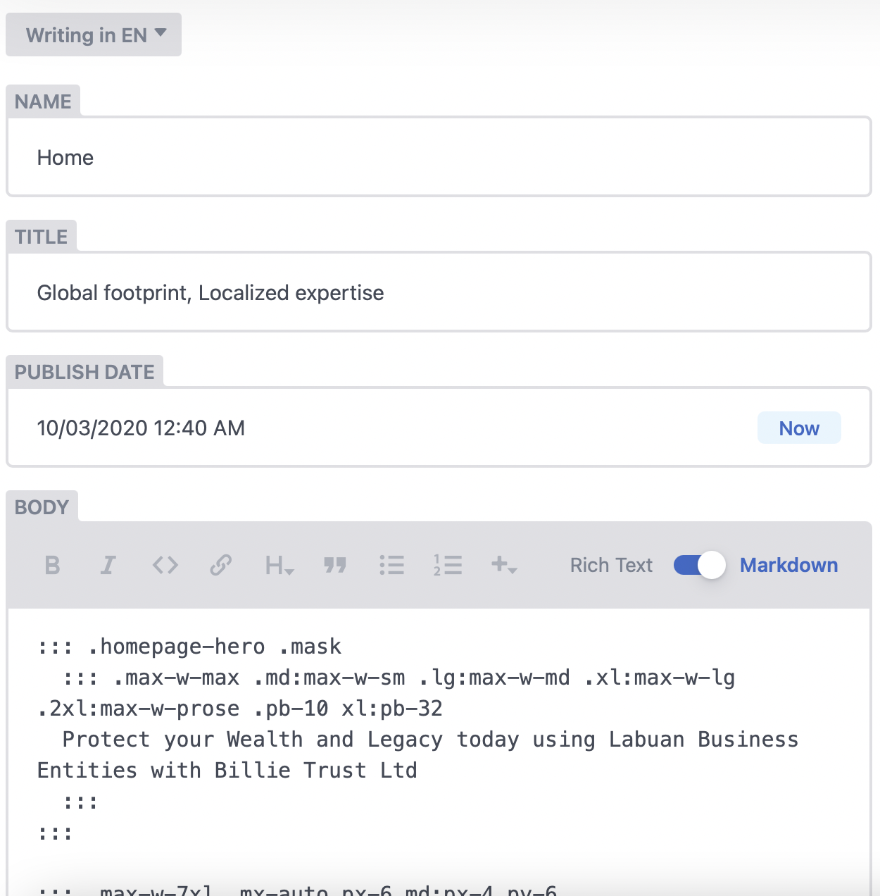

## Login the CMS [here](https://billietrust.com/admin)

:::note

Use your own id as you have registered before.

:::

## Go to Pages

1. Navigate to `Pages` as shown below

2. Scroll to the list of pages and click on the page that you want to modify.

## Alteration

Fill up all the necessary fields (writing in EN)

:::important

This CMS is capable to handle two languages which allow the website to be served in preferred user language. The default language is *English*. At the moment, your package does not include this feature. Please contact [us](mailto:muhaimin@mcstech.dev) to upgrade.

:::

:::caution

You may have notice some technical aspects included in the writing page. This details required to maintain the style of the design agreed. Please edit with cautios

:::

## Publish

Once everything is set up, click `Publish`. Your changes will be reflected after few minutes. Please check it regularly after some time
