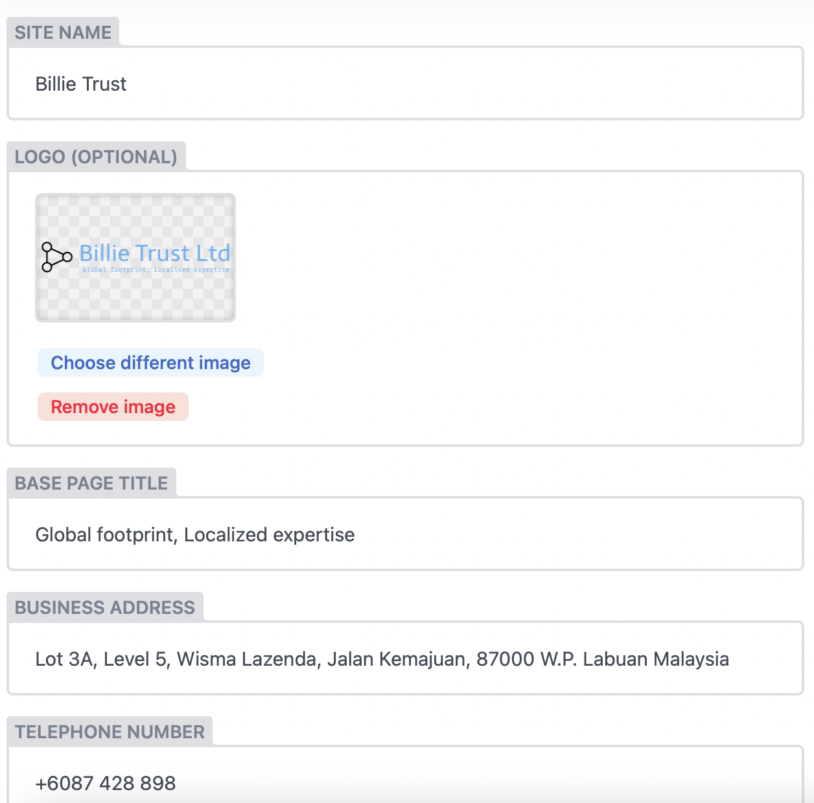

## Login the CMS [here](https://billietrust.com/admin)

:::note

Use your own id as you have registered before.

:::

## Navigation

1. Navigate to `Settings` as shown below

2. Click on `General`.

## Edit Website Info

Fill up all the necessary fields

:::caution

You may replace the logo but be sure to notify [us](mailto:muhaimin@mcstech.dev) as it may need some technical changes on the back-end. 

:::

## Publish

Once everything is set up, click `Publish`. Your changes will be reflected after few minutes. Please check it regularly after some time
